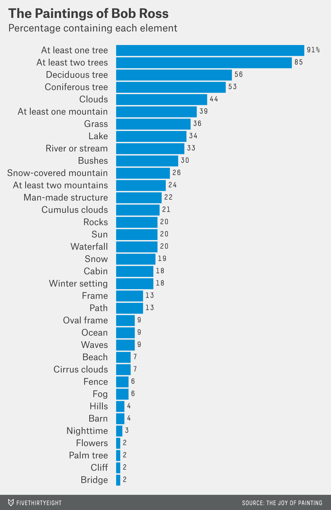
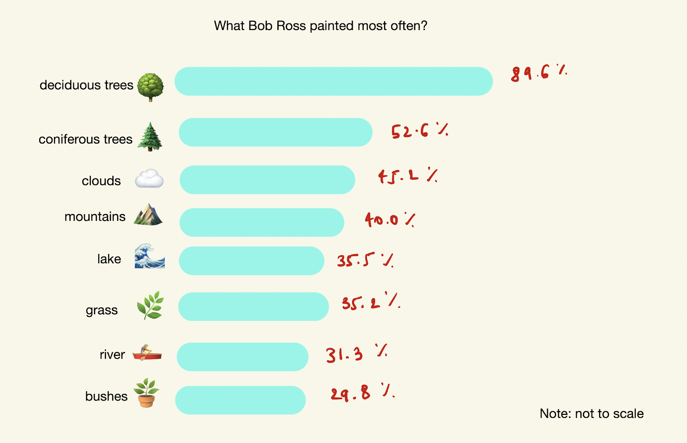
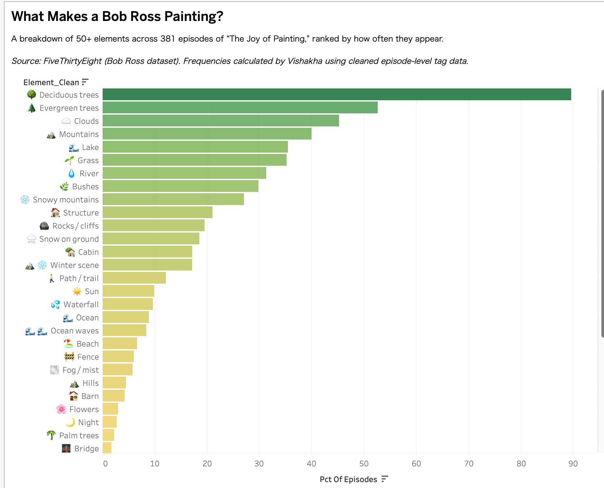
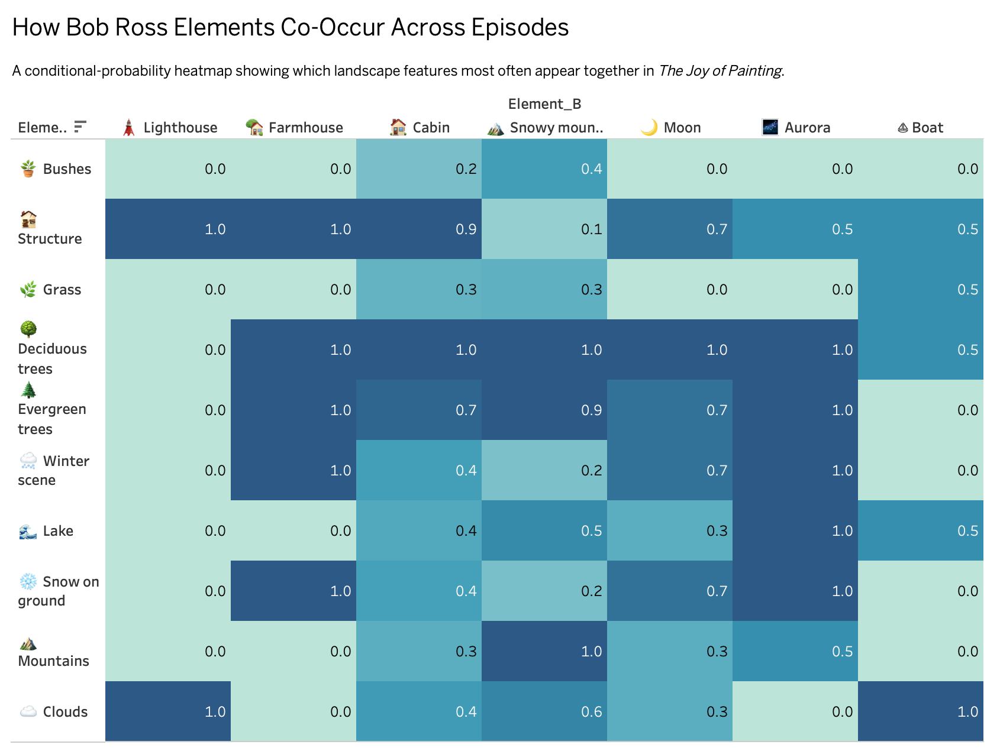
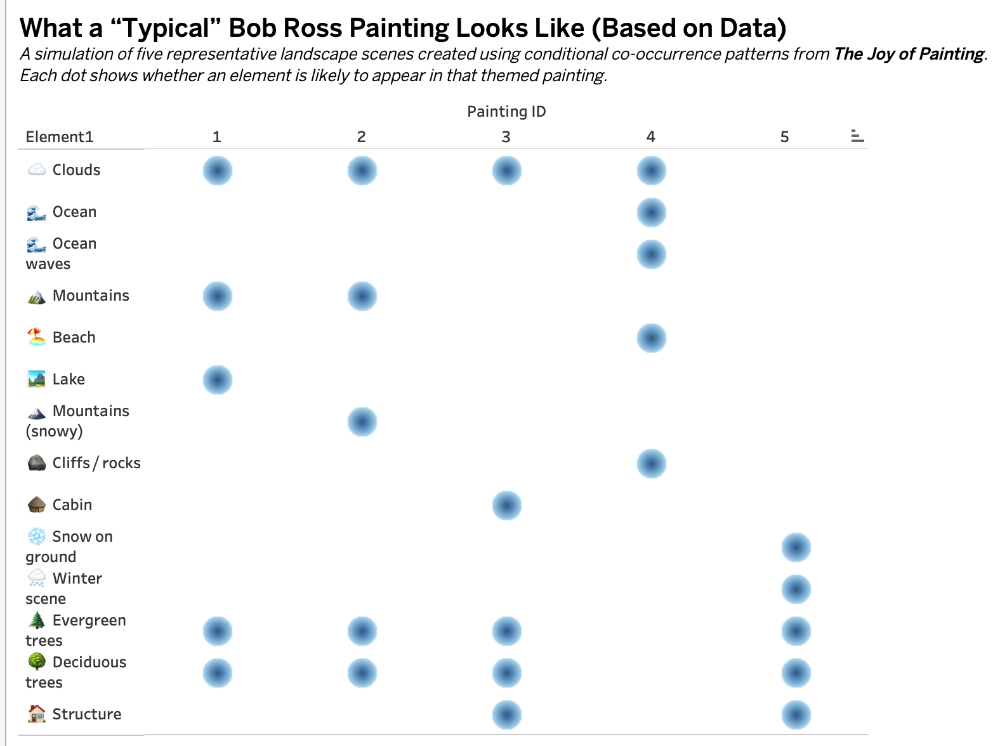

# 🖼️ Critique by Design: A Statistical Analysis of the Work of Bob Ross 🪼✨  
**MakeoverMonday Redesign — Vishakha Pathak**

## Original Data Visualization and Why I Selected It

For this assignment, I selected a visualization from FiveThirtyEight’s article “A Statistical Analysis of the Work of Bob Ross.” The dataset includes tag-level information describing what appears in each episode of The Joy of Painting. The original chart in the article is a long ranked list showing how frequently each element appears across Ross’s paintings.

<p align="center">
  
</p>

### Why I chose this visualization 🐚

The FiveThirtyEight article provides a thoughtful statistical analysis of Bob Ross’s work. It discusses conditional probability, joint appearance of elements, and even clustering techniques to explore structure within the paintings. However, the main chart that accompanies this analysis is simply a descending bar chart of individual tag frequencies. This created an interesting contrast: the article talks about relationships and co-occurrence, but the visualization does not actually depict any of those ideas.

This disconnect made it a compelling candidate for redesign. The bar chart is accurate and readable at a surface level, but it stops at raw frequency. It does not help the viewer understand how elements relate to each other or what a typical Bob Ross landscape looks like. Trees, clouds, lakes, and mountains appear at the top of the list, but without grouping or hierarchy, the meaning behind these frequencies is not immediately clear. Rare elements appear directly beside core elements, all with identical visual weight, which forces the viewer to mentally sort through more than thirty categories on their own.

What stood out most is that looking only at the most occurring elements did not meaningfully answer the question the article itself raises: what structural patterns define Bob Ross’s work? Frequency alone cannot tell us which combinations matter, why certain scenes repeat, or what constitutes a typical painting. Covariance and conditional probability were central to the narrative of the article, but they were not visualized at all.

These gaps created an opportunity to design something more intentional. A more effective visualization could highlight not only what appears most often, but also what appears together, and how a viewer might interpret the structure of an “average” Bob Ross landscape.

### Why I selected this visualization 🌊

I chose this dataset because Bob Ross’s work is deeply iconic and recognizable, yet few people have explored the data behind his art. The original visualization focused only on raw counts and did not reveal:

- which elements appear together  
- which elements dominate a “typical” Bob Ross scene  
- what structural patterns define his art across 400+ episodes  

There was an opportunity to redesign the visualization in a way that tells a clearer, richer story about the underlying structure of his paintings.

---

## Critique of the Original Viz (Using Stephen Few’s Data Visualization Effectiveness Profile) 🌟

I used Stephen Few’s framework to evaluate the original visualization, and a few patterns immediately stood out.

### Clarity  
The chart showed the raw counts clearly enough, but it did not really communicate any deeper meaning. Everything was presented at the same visual level, with no grouping, hierarchy, or color cues to guide the reader.

### Accuracy  
The numbers themselves were accurate, but accuracy alone was not enough here. Because all elements looked identical on the screen, it was easy to assume that everything mattered equally, even though some elements define Bob Ross’s style far more than others.

### Aesthetics  
The design felt very utilitarian. There was almost no spacing, no visual structure, and no sense of intention behind how the information was laid out. It was clean, but not expressive.

### Meaning and Insight  
This is where the chart struggled the most. It did not help answer:

> What does a typical Bob Ross painting actually look like?

It also never visualized co-occurrence or relationships between elements, even though the FiveThirtyEight article talks about these concepts extensively. Without that, the visualization stays at isolated frequencies rather than patterns.

### Target Audience Needs  
For general readers, the story could have been stronger. For analytical audiences, the visualization did not go deep enough into structure or relationships. It sat in the middle, making it less effective for both.

### Reflection on the critique method 🪸  
Stephen Few’s framework was helpful because it made me look at the visualization in a structured way. Compared to Good Charts, which focuses on narrative, Few’s method felt more diagnostic. Using both mindsets helped me think through what the original chart was missing and how I could redesign it to tell the story the data hints at.

---

## Sketching the Solution 🌈

Before building the redesign, I created a simple **emoji-based sketch** of the frequency chart to test whether using icons would make the landscape elements easier to interpret.

<p align="center">
  
</p>

---

## Testing the Solution 🧪🐙

I shared early wireframes with three classmates during an informal critique session. 

### Participants (PII removed) 
- Student, mid-20s, MSPPM program — has taken previous data visualization courses
- Student, mid-20s, MISM program — no prior visualization background
- Student, late-20s, Tepper School of Business — design and communication experience

### Feedback Themes #### 
⭐ What worked well 
- The **emoji-supported bar chart** was described as “instantly readable” and “fun without being distracting.”
-  Peers said the layout made it **easy to compare frequencies quickly**, much clearer than the original visualization.
- Several people liked that the redesign stayed focused on a **single clear question**: what Bob Ross paints most often.

#### ⚠️ What needed improvement 
- The **co-occurrence heatmap** felt dense when first viewed, and people said they needed a moment to interpret it.
- A few labels were long or visually similar, so classmates recommended using **emojis as anchors** to help differentiate categories.
- One participant suggested adding a short caption explicitly stating what the heatmap reveals (e.g., which elements pair together most often).

### 🎯 Actionable changes I implemented after testing 
- Added **emoji markers** to the heatmap labels to reduce scanning friction.
- Simplified the heatmap by focusing on **the strongest co-occurrences** rather than every possible pair.
- Adjusted the **color scale** to improve contrast and help viewers spot patterns immediately.
- Strengthened **titles and subtitles** to reinforce the narrative and clarify what each chart is meant to show.

---

## Step Five: Final Redesigned Visualizations 🌟🎨

### 1. Visualization 1 — “What Bob Ross Painted Most Often”  
📊 Emoji-enhanced frequency chart built in Tableau.

For the redesign, I wanted the chart to feel clearer and more inviting than the original long bar list. Adding emojis made the elements instantly recognizable and helped break up categories that otherwise look very similar in text. A cleaner color ramp and simpler layout make it much easier to see which elements define a “typical” Bob Ross painting, without overwhelming the viewer with unnecessary detail.

<p align="center">
  
</p>

[View in Tableau](https://public.tableau.com/views/Book1_17630934455190/Sheet1)

---

### 2. Visualization 2 — “How Elements Co-Occur Across Episodes”  
🔥 Conditional probability heatmap (P(A|B)) built in Tableau.

For this redesign, I wanted to move beyond simple frequency and show which elements actually appear together. The heatmap makes these patterns visible at a glance—like cabins pairing with snowy mountains or winter scenes clustering with snow on the ground. Adding emojis and tightening the color scale helped make a dense chart feel more readable while still highlighting the relationships that define Bob Ross’s landscapes.

<p align="center">
  
</p>

[View in Tableau](https://public.tableau.com/views/Book4_17631635148130/Sheet1)

---

### 3. Visualization 3 — “Five Data-Generated ‘Typical’ Bob Ross Paintings”  
🎨 Simulated scenes using co-occurrence patterns.

This chart shows five “typical” Bob Ross scenes generated from the dataset using conditional probability. Each painting starts with a core element—like a lake or mountains and adds the four elements most likely to appear with it. Visualizing these combinations as emoji-labeled bubbles makes it easy to compare the structure of different scene types at a glance. It is a playful way to translate the numbers into something that actually feels like a Bob Ross painting.

<p align="center">
  
</p>

[View in Tableau](https://public.tableau.com/views/Book3_17631609191530/Sheet5)

---

## What I Attempted to Do Differently 🪼✨  

In the redesign, I wanted to move beyond simply replotting the data. Instead of a flat list of counts, I tried to build a clearer narrative — what appears most often, what appears together, and what a “typical” Bob Ross scene might look like. I made co-occurrence patterns visible, added a small simulation, and used emojis and cleaner spacing to make the charts more approachable.

---

## Data and Source Information

- **Dataset:** MakeoverMonday — Bob Ross Paintings  
- **Source:** https://makeovermonday.co.uk  
- Processed in Python (episode-element matrix, conditional probability, simulation)  
- Visualized in Tableau Public  

---

## Python Analysis and Reproducibility 🐠📓

All probability calculations, co-occurrence analysis, and simulated “average” Bob Ross paintings were generated in Python.

**➡️ The full notebook is available at: https://github.com/vishakha1801/tellin_stories_with_data/blob/main/bob_ross.ipynb **

It includes:

- Tag cleaning  
- Episode × element binary matrix  
- Conditional and joint probability calculations  
- Top co-occurring element extraction  
- Painting simulations  
- CSV exports for Tableau  

---
## Bonus: AI-Generated “Average” Painting for Painting 3 🐙🌲  

As a small bonus experiment, I used ChatGPT to generate an illustrative “average” Bob Ross–style scene based on **Painting 3** from my simulation (the cabin-centered scene with trees, mountains, water, and sky).

I prompted ChatGPT with a description derived directly from the co-occurrence patterns in the data. 

Result: 
<p align="center">  </p>

Prompt: 
```text
You are helping me visualize an ‘average’ Bob Ross painting based on my simulated Painting 3. 
Painting 3 is centered on a cozy cabin scene. Please generate a Bob Ross–style landscape that includes:
- a small wooden cabin in the foreground
- evergreen trees surrounding the cabin
- snow-capped mountains in the midground
- a calm lake reflecting the sky
- soft, layered clouds in a sunset sky

The overall mood should feel calm and hopeful, with gentle lighting and soft brush textures, similar to an episode of “The Joy of Painting.”
```

---
## AI Usage Disclosure

I used ChatGPT to assist with:
- Python helper functions  
- Formatting this Markdown  

All analysis, design decisions, critique insights, and Tableau builds were done by me.
